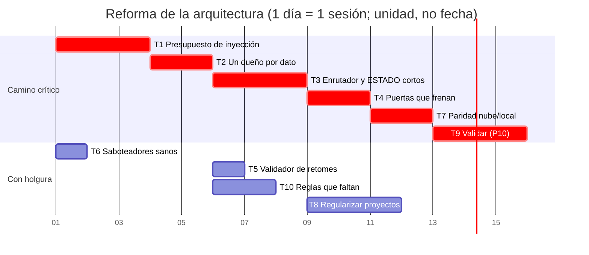

# Diagnóstico de arquitectura del método — 2026-09-28

**Qué es.** La lista de los problemas de arquitectura del sistema de trabajo
**entero** —perfil global, hooks, cascada, enrutador, contratos, PDP, estado,
retomes, verificadores, nube— **medidos** en la sesión del 2026-09-28
(notebook, revisando la tanda de BLACK (98)–(108b)). Es la entrada de las
sesiones que Fran va a dedicar a reformar la arquitectura y a implementarla de
forma sostenible. **No propone la solución**: dice qué falla, con qué
evidencia, cuánto cuesta y en qué orden conviene atacarlo.

**Dónde encaja.** Es insumo de la **fase 7** de este proyecto (validar ≠
verificar) y de lo que quedó abierto de P1 y P5 (`ESTADO_ACTUAL.md`, «Lo que
FALTA»). Cada problema lleva su **grado** (regla 1): `confirmado` = medido hoy
sobre el objeto; `probable` = medido en parte; `hipótesis` = sin medir.

---

## 1. Los problemas

### A1. La capa que «se lee sola» no se lee — `confirmado`

El hook `SessionStart` inyecta `chequeo-de-trabajo.md` (**129,3 KB, 1869
líneas, 285 lecciones**) y `pilares.md` (**12,6 KB**). En esta sesión el
harness respondió a los dos con *«Output too large … Full output saved to …
Preview (first 2KB)»*: **la sesión ve 2 KB de cada uno**. Lo que sí entra
entero es `apertura-proyecto.md` (9,4 KB) y el recordatorio del
`UserPromptSubmit`.

- **Consecuencia:** el triage `propia`/`foldeada` de `aprender.py` —el
  mecanismo que decide que una lección «llega a las sesiones»— entrega a un
  archivo que **nadie lee**. El 17/09 este proyecto midió 95 KB y escribió
  «la inyección dejó de ser entrega»; desde entonces creció **34 KB más**.
  Hoy mismo se foldeó una lección más ahí.
- **Pilar:** el flujo de información que falta (Meadows): el medidor está en
  el sótano otra vez.
- **Lo que no se sabe:** el umbral exacto del harness (se vio pasar 9,4 KB y
  cortar 12,6 KB).

### A2. Documentos de estado que crecen sin techo — `confirmado`

| Archivo | Dice ser | Mide hoy |
|---|---|---|
| `CLAUDE.md` raíz (enrutador) | «sólo dice a dónde ir» | **47,2 KB**; 16 filas suman 24 160 caracteres y **la de BLACK sola 11 181** |
| `black/ESTADO_ACTUAL.md` | «entero — es corto» (contrato) | **118 KB, 1563 líneas** |
| `black/sesiones/HANDOFF.md` | «el paquete mínimo… se sobreescribe» | **250 KB, 3558 líneas** (no se sobreescribe: se apila) |
| `black/docs/03-bitacora.md` | historial | 572 KB |

El enrutador se carga **solo** en cada sesión (nivel 2): cada fila larga es
contexto que falta para pensar. Y un «índice» que narra la historia completa de
cada proyecto es un segundo `ESTADO_ACTUAL` (ver A3).

### A3. Un mismo dato vive en N lugares y diverge — `confirmado`

El estado de BLACK vive, a la vez, en la fila del enrutador, `ESTADO_ACTUAL`,
el bloque de arriba del `HANDOFF`, el `PDP`, la bitácora, tres retomes y
`REVISAR-98-108`. La cascada nueva (§3) midió hoy, sobre los 17 proyectos:

| Proyecto | Atraso medido por git |
|---|---|
| apunte-iise | ESTADO 1 commit, HANDOFF 2, enrutador más viejo que el ESTADO |
| clase-asincronica-3 | ESTADO 2, HANDOFF 1 |
| clases-aed | ESTADO 1, HANDOFF 4, enrutador 2,4 días; rama sin remote |
| fisica-espacial | ESTADO 1, HANDOFF 1, enrutador 1 día |
| taller-de-fisica | enrutador más viejo |
| teoria-circuitos | ESTADO 1; rama sin remote |
| arquitectura-se | HANDOFF 1, **enrutador 9,5 días** |
| black | ESTADO 1 (antes de esta sesión), enrutador más viejo |
| lavarropas-drean | ESTADO 1, HANDOFF 3, enrutador |
| metodo-agustin | HANDOFF 1 |
| repaso-iise, diagnostico-msi, telefono-samsung, telescopio | sin ESTADO ni HANDOFF (cerrados/dormidos: falta decidir si la regla les aplica) |

«Atraso» = el último commit del proyecto no tocó ese documento (regla 5: el
checkpoint son los cuatro). **Mide el registro, no el contenido**: un atraso
puede ser inofensivo; lo que dice es que nadie lo revisó.

- **Y el PDP también:** el de `arquitectura-se` tenía la fila 6 sin
  «CERRADA», así que el hook `fase_activa` inyectaba «fase 6 — Migrar»
  mientras el `ESTADO_ACTUAL` decía «fase 7 abierta» (corregido hoy). Además
  el PDP **no declara el tipo** de fase (Pre-A…E), que el hook exige — y
  `medir-fase.py` le da **OK** igual: hay **dos definiciones de «PDP válido»**
  (el hook y el medidor) y no coinciden. Hoy: 13 PDP, 6 en verde, 7 sin migrar
  al molde nuevo.
- **Pilar:** «un dato que vive en dos lados diverge» — escrito en el perfil,
  violado por la estructura misma.

### A4. La cascada medía existencia, no vigencia — `confirmado`, **arreglado en parte hoy**

`cascada.ps1` daba «completa» si los archivos existían. No veía: el estado real
(para BLACK imprimía un párrafo del preámbulo), las rutas nombradas entre
comillas invertidas del contrato, los documentos que el contrato **no** nombra
(BLACK: **16**, entre ellos `docs/13`–`docs/17` y los tres retomes que dirigen
la sesión), ni si algo quedó sin commitear, sin pushear o atrasado.

**Hoy:** nivel 6 con rutas en backticks y lista de «sin nombrar», contraste de
estado por el título que afirma la fase, y una sección **AL DÍA** por git.
Saboteador nuevo `probar-cascada.ps1` (7 casos, repo sintético con remote),
registrado en `chequeo-completo.ps1` y probado en rojo cegando la cascada.

**Falta:** que corra sola (no está en el arranque) y que **bloquee** (A5).

### A5. Los verificadores informan, no frenan — `confirmado`

El arranque de hoy avisó que la última corrida de saboteadores (27/09) había
quedado **en rojo**; entre medio entraron 14 commits de la tanda de nube sin que
nada lo frenara (la nube ni siquiera puede correrlos: A8). Nada impide commitear con el `ESTADO` atrasado ni pushear con un medidor en
rojo. Todo depende de que la sesión decida correr y obedecer: la misma clase de
regla-intención que el enrutador dice haber dejado atrás.

### A6. La capa de saboteadores es lenta e intermitente — `confirmado` / `probable`

- **Lenta:** el enrutador dice «~96 s» (y «~110 s» las dos capas); hoy tardó
  **310 s** el de la estructura y **378 s** el de los frenos, ~14 min en total.
  Una capa de 14 min que el arranque sólo *avisa* no se corre.
- **Intermitente:** `probar-guardia-fanout.ps1` dio rojo **en la corrida
  completa** el 27/09 y el 28/09 («verify-install NO volvió a verde después de
  restaurar») y **verde corrido solo** (5 modos + control). Una segunda corrida
  completa, **sin tocar nada del perfil mientras corría**, lo dio en verde.
  `probable`: la primera falló por un cambio concurrente del perfil (esa sesión
  registró lecciones y editó `chequeo-de-trabajo.md` durante la corrida). Nada
  impide trabajar mientras la capa corre, y nada avisa que el rojo puede ser
  de eso. Un saboteador que falla a veces entrena a ignorar el rojo.
- **Y cuando anda, sirve:** la segunda corrida atrapó un error de esta misma
  sesión (un mail de prueba en `probar-cascada.ps1`, regla 5 de la
  estructura), que los medidores rápidos no ven porque corrieron antes de
  escribirlo.

### A7. El retome, la interfaz entre sesiones, no tiene verificador — `confirmado`

- Los dos comandos de `aprender.py` de `RETOME-LOCAL.md` (2b) **no corrían**:
  faltaban `--triage` y `--opuesto`, obligatorios desde la fase 6.
- Los conteos esperados están escritos a mano y dependen de la plataforma
  (`prueba_herramientas.py`: 184 en la nube Linux, 183 en Windows antes de hoy).
- Los retomes duplican el estado (A3) y nadie mide que sus rutas existan, que
  sus comandos corran o que sus números sigan siendo ciertos.

### A8. Nube y local no tienen las mismas capacidades — `confirmado`

La nube no corre PowerShell ni tiene `perfil-global`: sus verificadores de
estructura, sus lecciones y sus saboteadores quedan **sin correr** hasta que una
sesión local los hereda en el retome (A7). La deuda de verificación viaja en
prosa.

### A9. Herramientas de medición con agujeros silenciosos — `confirmado`

Dos herramientas de BLACK en las que se apoyaba el diseño:
`lectores_global.py` tenía el opcode de `lqc2` equivocado **desde que nació**
(no veía ninguna lectura vectorial) y `censo_ab.py` tenía dos huecos de
expresión regular (**103 → 110** funciones). Sus pruebas sólo cubrían los
casos que plantó su autor. Es D12 otra vez («un saboteador escrito por el
autor del freno hereda su punto ciego»). **Lo que lo encontró** fue contrastar
dos métodos independientes (el C de Ghidra contra las instrucciones): esa
práctica no es regla de nadie.

### A10. El grado de una premisa vive en prosa — `confirmado`

BLACK (108) diseñó la muerte («copiar `J+0x5F0` a J2») sobre la premisa de que
ese valor sube en algún momento. Hoy: vale **0 en los 7 volcados** y **ninguna
instrucción del ELF escribe ahí un valor no nulo**. El diseño decía «el camino,
confirmado en frío; quién lo sube, desconocido» y aun así se construyó encima.
La regla 1 existe; lo que falta es que el grado de cada premisa esté donde el
diseño la usa y que algo impida construir sobre una `hipótesis`.

### A11. Sesiones paralelas sin protocolo medido — `probable`

Nube y notebook numeran en paralelo ((109) y (120, nube)) y resuelven choques
de bitácora a mano. Ya hubo un `git reset --hard` intentado para alinear `main`
(REVISAR A13), y hoy la notebook estaba **14 commits atrás** de `origin/main`
al abrir. El único freno es `verificar-sincronia.ps1`, que avisa.

**Y se vio en vivo, peor** (`confirmado`): mientras esta sesión corría la
tercera capa de saboteadores, **otra sesión de Claude trabajaba en
`fisica-espacial` en el mismo árbol de trabajo**, recompiló sus PDF a las
19:32 y commiteó (`1b4d4db`). La limpieza dio rojo en «apuntes publicados en
Drive» por ese cambio ajeno, que no era un error. Dos sesiones en el mismo
checkout comparten índice, archivos y medidores: cualquier rojo de una puede
ser trabajo en curso de la otra, y nada lo distingue. Es candidato fuerte a
explicar también el rojo intermitente de A6.

---

## 2. N²: quién le entrega qué a quién

Diagonal = componente. Celda (fila → columna) = lo que la fila le entrega a la
columna. Marca de la interfaz: **[V]** la verifica una herramienta, **[M]**
depende de que alguien se acuerde, **[R]** medida rota hoy.

| | Reglas + pilares | Hooks | Lecciones | Enrutador | Contrato | PDP | ESTADO/HANDOFF | Retome | Verificadores | **Sesión** |
|---|---|---|---|---|---|---|---|---|---|---|
| **Reglas + pilares** | ■ | texto a inyectar **[V]** verify-install | criterio de entrada **[V]** `--opuesto` | la cascada (tabla) **[M]** | molde **[M]** | molde de fase **[V]** medir-fase (7 de 13 sin migrar; no mide el tipo que exige el hook) | regla 5 **[V]** desde hoy (no bloquea) | spec del retome **[M]** | qué medir **[M]** | pilares **[R]** 2 KB de 12,6 |
| **Hooks** | | ■ | inyección **[R]** A1 | carga sola **[V]** | sólo si se abre en la carpeta **[M]** | fase activa **[R]** A3 (arq-se) | — | — | arranque rápido **[V]**, saboteadores sólo aviso **[M]** | cuadros por prompt **[V]** |
| **Lecciones** | | | ■ | — | — | — | — | — | triage **[V]** sin-triage | **[R]** A1 |
| **Enrutador** | | | | ■ | enlace **[V]** regla 3b | — | fila ↔ estado **[V]** desde hoy (no bloquea) | — | — | 47 KB por sesión **[R]** A2 |
| **Contrato** | | | | | ■ | índice **[M]** | índice **[M]** | índice **[R]** 16 sin nombrar (BLACK) | enlaces **[V]** regla 7 | qué leer **[M]** |
| **PDP** | | | | | | ■ | criterio de salida **[M]** | fase y criterio **[M]** | — | fase activa vía hook **[R]** A3 |
| **ESTADO/HANDOFF** | | | | fila **[M]** | | | ■ | lo que se copia **[M]** A3 | — | «es corto» **[R]** A2 |
| **Retome** | | | | | | | | ■ | comandos y números **[R]** A7 | primer mensaje **[M]** |
| **Verificadores** | | | | | | | | | ■ | verde/rojo **[M]** A5: no frena |
| **Nube (git)** | | | lecciones sin correr **[R]** A8 | | | | | deuda en prosa **[R]** A7-A8 | sin PowerShell **[R]** A8 | ■ |

**Lectura.** La columna **Sesión** —el único consumidor real de todo el
método— tiene **una sola** entrada verificada y cinco rotas. Casi todo el
esfuerzo de verificación está en las filas de arriba (que los archivos
existan, estén instalados, tengan triage); casi nada mide que **lleguen** y que
**frenen**. Es la distinción de la fase 7: verificar la pieza no es validar que
sirva.

---

## 3. Camino crítico y plan de sesiones

Tareas de la reforma, con dependencias reales (una tarea depende de otra sólo
si sin la primera la segunda se hace dos veces). Duración **en sesiones, a ojo**
(`hipótesis`: sale de lo que costaron las fases 5 y 6 de este proyecto, 1-3
sesiones cada una).

| Id | Tarea | Depende de | Sesiones | Cierra |
|---|---|---|---|---|
| T1 | **Presupuesto de inyección**: qué ve de verdad la sesión; partir lo inyectado a lo que entra entero; medirlo con un saboteador que compare lo emitido contra el umbral | — | 2-3 | A1 |
| T2 | **Un dueño por dato**: tabla de cada dato (fase, estado, próximos pasos, conteos) con su archivo fuente; el resto, vista generada o puntero | T1 | 1-2 | A3 |
| T3 | **Enrutador y ESTADO como vistas cortas**: fila de ≤ N caracteres, ESTADO de ≤ N KB, HANDOFF que se sobreescribe de verdad; lo histórico a la bitácora | T2 | 2-4 | A2 |
| T4 | **Puertas**: pre-commit/pre-push que corre la capa rápida y `cascada AL DÍA` y **frena** (con salida explícita y registrada) | T3 | 1-2 | A5, A4 |
| T5 | **Validador de retomes**: rutas existen, comandos corren en seco, números derivados y no escritos | T2 | 1 | A7 |
| T6 | **Saboteadores sanos**: aislar el intermitente, tiempos reales en el enrutador, capa lenta partida o nocturna-manual | — | 1 | A6 |
| T7 | **Paridad nube/local**: los verificadores esenciales en Python (corren en los dos), lo que no, declarado | T4, T5 | 1-2 | A8 |
| T8 | **Regularizar proyectos**: los 11 atrasos de A3, tipo de fase en los PDP, decidir la regla para los cerrados | T3 | 2-3 | A3 |
| T9 | **Validar (P10)**: una sesión real con la arquitectura nueva, costo medido contra la anterior | T4, T7, T8 | 2-3 | fase 7 |
| T10 | **Reglas de método que faltan**: premisa con grado en el diseño (A10), contraste por dos métodos (A9), protocolo de sesiones paralelas (A11) | T2 | 1-2 | A9-A11 |

**Camino crítico:** T1 → T2 → T3 → T4 → T7 → T9, **~9 a 16 sesiones**
(`hipótesis`). T5, T6, T8 y T10 tienen holgura: se hacen en paralelo al
camino o en los huecos, sin moverlo. **T1 va primero** porque todo lo demás
son reglas y lecciones que hoy no llegan a la sesión: arreglarlas antes de que
lleguen es trabajar a ciegas.

---

## 4. Lo que esta sesión ya dejó hecho (para no rehacerlo)

- `cascada.ps1` con **AL DÍA** por git, documentos sin nombrar y estado real;
  `probar-cascada.ps1` (7 casos) en `chequeo-completo.ps1`, probado en rojo.
- Las dos lecciones de la nube registradas (con `--triage` y `--opuesto`).
- BLACK: `lectores_global.py` (lqc2), `censo_ab.py` (dos huecos) y
  `coop_ia.py` (listado atado al código), cada uno con su prueba en rojo.
- PDP de `arquitectura-se`: fila 6 marcada **CERRADA** (A3).

**Lo que NO se tocó a propósito**: el contenido de los `ESTADO_ACTUAL` de los
otros proyectos (A3). Tocarlos para apagar el aviso, sin revisar si dicen la
verdad, es exactamente lo que este diagnóstico describe como falla.
