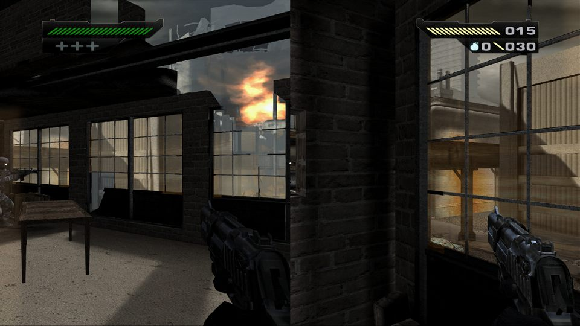
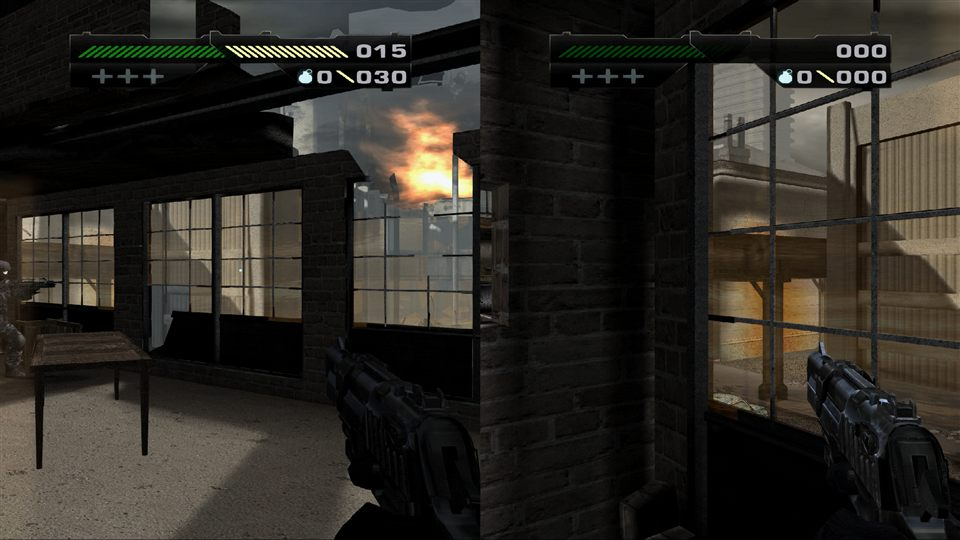
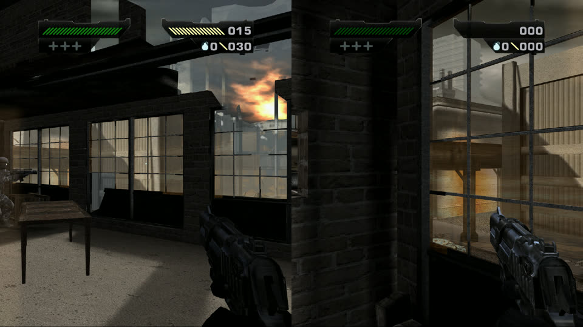

# 18 — La PDR del coop: el diseño para que lo revises

> Escrito el 2026-10-02 (112). Es el resumen, para leer de una, de tres documentos técnicos:
> `docs/14` (el plano: qué toca el mod y dónde), `docs/16` (cómo se arregla cada cosa) y `docs/17` (la lista de
> todo lo que falta). **PDR** = *Preliminary Design Review* (NASA, fin de la Fase B): la revisión del diseño **antes
> de fabricar**. Sin tu ok no se construye nada de lo que dice «falta construir».

## Qué te pido

Que leas esto y me contestes las **seis preguntas del final** (sí / no / cambialo así). Con eso la Fase B se
cierra y arranca la C: fabricar el mod entero, pieza por pieza, cada una con su prueba.

## Cómo leer los grados

- **Medido**: se tocó la causa y se vio el efecto (en pantalla o en la memoria), con un control que da distinto.
- **Leído**: sale de leer el código del juego, sin probarlo todavía. Suele estar bien, pero no está probado.
- **Supuesto**: es lo que creo, sin leer ni medir. Va a la lista de riesgos.

---

## 1. Lo que el mod ya hace hoy (todo medido)

Prendés el acceso «JUGAR BLACK COOP» y, sin nada más corriendo:

- **Aparece un segundo jugador** en la carga de cualquiera de los 8 niveles, y la campaña entera carga de corrido
  sin colgarse (8 de 8, con la IA prendida).
- **La pantalla se parte en dos**: vos a la izquierda, tu amigo a la derecha, cada uno con su cámara.
- **J2 camina, mira, dispara, hace daño, recarga y cambia de arma** con su mando (juntar del piso todavía no:
  ver la clase B).
- **Los enemigos lo ven y le tiran a él también** (un enemigo elige a J2 y le baja la vida; sin el arreglo, nunca).
- **Si muere cualquiera de los dos, pierden los dos** («MISSION FAILED»), como pediste. Reiniciar la misión anda.
- **J2 tiene cuerpo** visto desde tu mitad (un soldado aliado que lo sigue), en 5 de los 8 niveles.
- Ritmo: ~30 cuadros por segundo en cinco niveles, ~24 en los tres más pesados (Steelworks, Asylum, City Bridge).

## 2. Lo que falta, y cómo se arregla

BLACK se escribió para **un** jugador. Todo lo que falta cae en tres clases, y cada clase tiene **un** arreglo de
fondo (no uno por síntoma):

### A. Lo que el jugador TIENE y J2 comparte con vos

| Qué se ve hoy | Cómo se arregla | Grado del diseño |
|---|---|---|
| **El disparo de J2 no suena** | darle a J2 su propia «vista de arma» (donde vive el sonido), armada con las piezas del juego | medido: sin el silenciador actual, suena como el tuyo |
| **El arma del último que cambió se dibuja en las dos mitades** | darle a J2 su propio modelo de arma | medido el problema; el arreglo, leído |
| **Un solo HUD** (vida, munición, retícula), el tuyo | **novedad de hoy:** el juego ya trae el HUD de **dos** jugadores construido y prende uno solo. Se prende el segundo, se le da su mitad de pantalla y se le hace leer los datos de J2 | **medido: prendido a mano, se ven dos HUD, uno por mitad.** **(113) medido también:** el de la derecha ya puede leer a un jugador (con el cambio de 11 números muestra tus valores; falta que lea los de J2), y **ya no queda apretado**: achicado a 3/4, cada uno entra en su mitad sin encimarse (foto de la pregunta 1) |
| El zoom de J2 cambiaría el tuyo | darle a J2 su propio campo visual | leído |
| El efecto de vida baja de J2 se prende en tu pantalla | con el HUD por jugador, cada efecto en su mitad | leído |

### B. Lo que el mundo le PREGUNTA a «el jugador»

| Qué pasa | Política (la tuya del 28/09) | Estado |
|---|---|---|
| Quién apunta la IA | a los dos | **medido**; límite: cada enemigo se queda con el primero que vio |
| Quién junta un arma / munición / botiquín | el primero que llega | J2 hoy junta lo que está bajo **vos** (medido); el arreglo (preguntar también por J2) está leído |
| Puertas, oleadas, fin de nivel | los abre J1 | leído: sólo te miran a vos |
| Si J2 se queda atrás cuando el nivel cambia de zona | **traer a J2 junto a vos** cuando se descarga la zona vieja | el «traer» anda (medido); el problema sin arreglo nunca se vio |
| Pausa y menús | sólo J1 | medido (Start del mando 2 no hace nada) |

### C. Lo que se VE del otro

| Qué falta | Cómo | Estado |
|---|---|---|
| **Vos no tenés cuerpo** en la mitad de J2 | un soldado aliado que te sigue, como el de J2 | medido |
| **J2 sin cuerpo en 3 niveles** (Wilderness, Steelworks, Gulag: no hay aliados) | **novedad de hoy:** hacer nacer el soldado con la fábrica de actores del juego **sin usar un generador del guion** (usar uno lo dejaba trabado: no vuelve a hacer nacer enemigos mientras el suyo viva) | leído hoy |
| Los carteles centrados caen sobre el corte | cada cartel en su mitad | sin diseño fino |

## 3. Lo que NO quedó medido (los riesgos que se llevan a la Fase C)

1. **El HUD doble con los datos de J2.** Los dos HUD ya se vieron, el de la derecha ya muestra datos de un jugador
   (los tuyos, con el cambio de 11 números) y el tamaño está resuelto (medido en (113)). Que muestre los de **J2**
   está leído, no visto. Primera prueba de la C.
2. **El cuerpo sin generador.** **(113) medido:** se hace nacer un soldado con la fábrica del juego y el generador del
   guion queda intacto. Falta que ese soldado sea aliado, no reciba daño y siga a su jugador (eso se hizo antes por
   el otro camino, no por éste). Dos cuerpos ocupan 2 de los 16 lugares de actores: supongo que sobran.
3. **Continuar desde un punto de control** con el coop: no se pudo probar (hay que llegar a uno jugando).
4. **Un cambio de zona real con J2 lejos**: no se vio nunca el problema, sólo el arreglo.
5. **Parsec**: nunca se probó. Lo hacés vos con tu amigo, cuando el mod esté entero.
6. Los avisos que el juego le da al HUD (daño recibido, mensajes) llevan el número de jugador: los de J2 hoy irían a
   tu mitad. Supuesto, sin contar.
7. **(113) Nuevo:** prender el HUD doble **dos veces** en el mismo nivel congela el juego (pasó 2 de 2 en las
   pruebas). El mod lo prende una sola vez por carga, así que no debería pasar; lo que hay que probar en la C es que
   al cambiar de nivel se apague bien (dos cargas seguidas).

## 4. Lo que sigue si das el ok: la Fase C (fabricar)

En este orden, cada pieza con su prueba y su control antes de pasar a la siguiente:

1. **El HUD doble** (lo más visible y lo más nuevo).
2. **El sonido y el arma de J2** (su vista de arma y su modelo de arma).
3. **Juntar por J2** (armas, munición, botiquines).
4. **Los cuerpos** en los 8 niveles (vos y J2).
5. **Traer a J2** en el cambio de zona; el zoom; los carteles.
6. La regresión: la campaña entera con todo prendido.

Después viene la D: **jugarlo vos** (con dos mandos, y después con Parsec), que es lo único que valida que sirve.

---

## Las seis preguntas

1. **HUD:** ¿te sirve el HUD del juego repetido en cada mitad (más fiel; hoy queda apretado, se puede achicar), o
   preferís uno más chico hecho por el mod (vida, munición y retícula nada más)? Las fotos de hoy, antes y con el
   segundo HUD prendido (el de la derecha todavía muestra ceros):

    

   **(113)** El mismo HUD doble achicado a 3/4: cada uno en su mitad, sin encimarse (el de la derecha todavía en ceros):

   
2. **Mensajes de misión** (los carteles que pausan el juego): ¿sólo en tu mitad, o en las dos?
3. **Cuerpos:** ¿está bien que cada jugador sea un soldado aliado genérico en los 8 niveles (aunque en algunos
   niveles no se parezca al personaje)?
4. **La IA:** cada enemigo se queda con el primero que vio, aunque el otro esté más cerca. ¿Alcanza para la primera
   versión, o es prioridad cambiarlo?
5. **Pausa:** sólo J1 pausa. ¿Con Parsec te molesta que tu amigo no pueda pausar?
6. **El orden de la Fase C** de arriba: ¿lo cambiarías?
