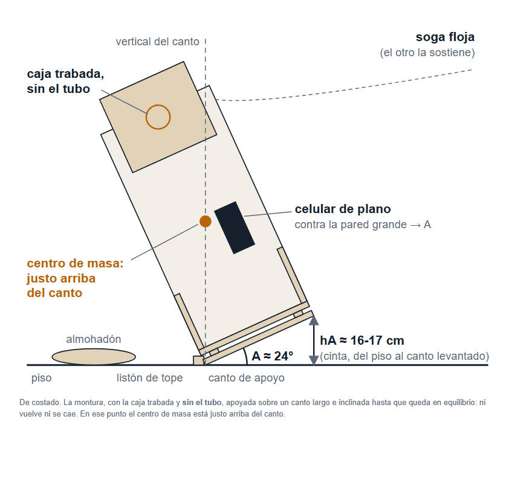
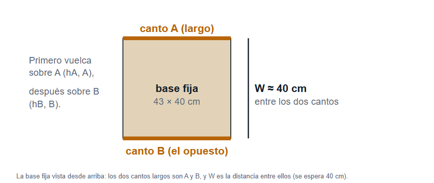
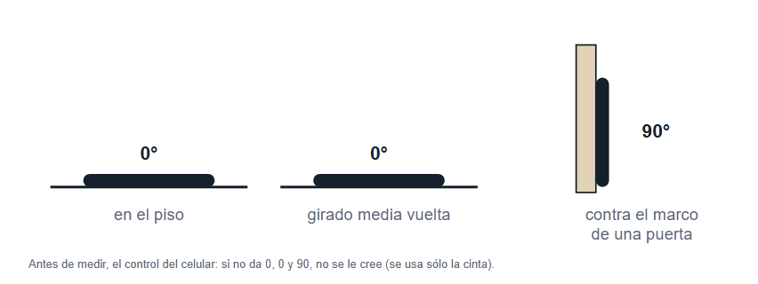
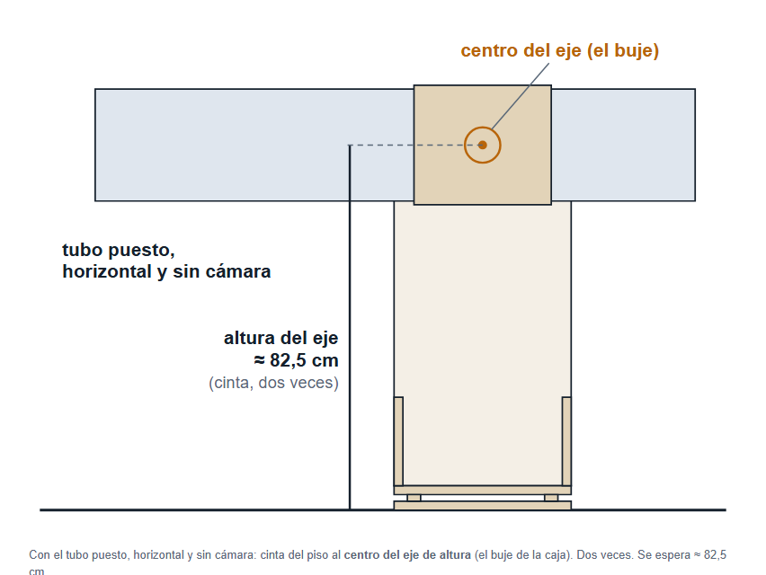
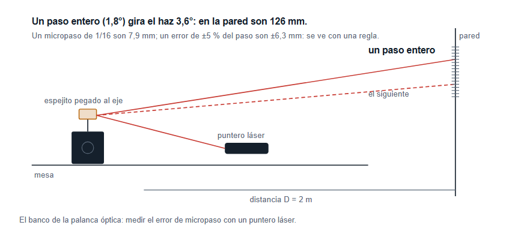

# Paso a paso — qué hacer y en qué orden

**Para Fran y Kevin.** Versión 5, 8 de octubre de 2026. Fuente en el repo:
`proyectos/ingenieria/telescopio/docs/11-paso-a-paso.md`.

> **Esto es sólo lo que hay que hacer.** El porqué está en «1 - El proyecto»;
> los mecanismos, los talleres de la zona y el cielo, en «3 - Mecanismos,
> proveedores y cielo».
> **Hoy no se corta, no se suelda y no se compra nada grande.** Primero hay que
> cerrar un número: la **altura del centro de masa** (hoy «63 cm, pero puede ser
> entre 58 y 69»). Da la muesca de cada telescopio en la corredera y cierra la
> fase 0. **Nuevo en la versión 5:** con la corredera, la forma de las chapas
> ya no depende de ese número si cae entre 55 y 69 cm: el vuelco la
> **confirma**. Y el paso 6 suma la **palanca óptica**, que mide el error del
> motor con un puntero láser. **Los dibujos de cómo medir el centro de masa
> están acá abajo** (pasos 1 y 2) y, para imprimir o tener en el celular, en el
> PDF **«Medir el centro de masa»** de esta misma carpeta, con la tabla para
> llenar. El modelo 3D (versión 10.5, con el 200 y un 12"):
> https://claude.ai/artifact/Sn7F7NGPrNdsJnwwnXTZfd

## Para Fran: los deberes antes de la próxima sesión (7 de octubre)

Con esto hecho, la próxima sesión cierra el centro de masa y arranca sin
esperar nada. **Mandá una foto de cada anotación** (o una captura de la nota
del celular): lo que no tiene foto, la sesión no lo puede dar por hecho.

| # | Qué | Cómo | Cuánto lleva |
|---|---|---|---|
| A | **El vuelco** de la montura sin tubo | paso 1 de abajo. Anotá **hA, A** (tres veces), **hB, B** (tres veces) y **W**, en cm y grados | una tarde, con Kevin |
| B | **La altura del eje** | paso 2 de abajo. Dos lecturas, en cm | 5 min |
| C | **La prueba de foco** con la Sony | de día, cámara sin lente con el adaptador en el portaocular, apuntá a algo lejano (una antena, un edificio a más de 200 m) y girá el portaocular de punta a punta. Anotá: **¿se ve nítido? sí o no**. Si no, ¿mejora yendo para adentro o para afuera, y se acaba el recorrido antes? Una foto de la pantalla en el mejor punto | 10 min |
| D | **Dos respuestas** (las otras dos ya están: 60 s por foto, y el cambio de telescopio sin tope) | 1) **¿La plataforma se queda en el patio, o viaja en auto a un cielo oscuro?** Si viaja: qué auto, o el largo y el ancho del baúl. Dato nuevo: Punta Indio (150 km, cielo oscuro) queda a 0,8° de latitud, y la plataforma sirve allá sin cambiar nada. 2) **¿Cuánto armado te parece bien**, del depósito al primer sub? (hoy el papel dice 20 min) | una decisión cada una |
| E | El inventario con calibre | paso 3 de abajo | 1 hora |
| F | El amigo metalúrgico | paso 5 de abajo: ¿torno? ¿electrodo o MIG? | un mensaje |

**Lo que más destraba: A y B** (cierran la fase 0 y dan la muesca del 200;
desde la versión 5 las chapas ya no esperan este número si cae entre 55 y 69
cm). **C** es la compuerta antes de comprar el corte láser. **D** fija el
tamaño de las piezas y el tiempo de armado. Los números que cada respuesta cambia están en «Requisitos»
(`docs/10-requisitos.md`, sección 11).

## Los pasos

| # | Qué hacer | Quién | Lleva |
|---|---|---|---|
| 1 | **El vuelco**: la montura sin el tubo, inclinada hasta el equilibrio | Fran y Kevin | una tarde |
| 2 | La altura del eje, con cinta (mismo día) | Fran | 5 min |
| 3 | Inventario de hierros y de lo rescatado, con calibre y foto | Fran | 1 hora |
| 4 | Elegir cuánto dura cada foto: **30 s o 60 s** | Fran | una decisión |
| 5 | Preguntarle al amigo metalúrgico: ¿tiene torno?, ¿suelda con electrodo o MIG? | Fran | un mensaje |
| 6 | El motor en el banco, moviendo un rodillo contra un retazo de hierro; y la **palanca óptica** (6b) | Fran y Kevin | una tarde |
| 7 | Cerrar el centro de masa, rehacer el modelo y revisar juntos | yo, y después los tres | una sesión |

**En paralelo:** del 1 al 6 arrancan todos juntos. El 7 espera al 1 y al 2.

### 1. El vuelco (el paso importante)
Da la altura del centro de masa de la montura. Sin levantar 40 kg.

- **Qué:** la montura **con la caja puesta y sin el tubo**.
- **Qué necesitás:** un listón de tope, un almohadón, una soga, cinta métrica y
  el celular con una app de nivel.
- **Cómo:**
  1. Trabá la caja (cinta o una cuña) y la base giratoria: si no, se mueven.
  2. Listón en el piso contra uno de los cantos largos, para que no resbale;
     almohadón del lado de la caída.
  3. Inclinala despacio sobre ese canto, con la soga floja del otro lado,
     hasta el **equilibrio**: ni vuelve ni se cae.
  4. Ahí el otro mide **hA**: del piso al canto levantado de la base fija. Y
     el celular, de plano contra la pared grande, marca el ángulo **A**. Tres
     veces.
  5. Lo mismo sobre el canto opuesto: **hB** y **B**.
  6. Medí **W**: la distancia entre los dos cantos sobre los que volcó.

- **Antes, el control del celular:** en el piso marca 0, dado vuelta también
  0, contra el marco de una puerta 90. Si no, no se le cree.

- **Seguridad:** uno sostiene la soga, el otro lee. Nunca con el tubo puesto.
- **Salió bien si:** A ≈ 24° y hA ≈ 16 a 17 cm (con W = 40), y las tres
  lecturas de cada lado dan lo mismo ±0,5 cm.

### 2. La altura del eje
Con el tubo puesto, horizontal y sin cámara: cinta del piso al **centro del
eje de altura** (el buje de la caja). Dos veces. Se espera ≈ 82,5 cm.

### 3. Inventario, con calibre
Foto de cada cosa **donde se lea el texto** y la medida al lado:
- **Hierros:** de cada tubo, T, ángulo y planchuela: la sección, el **espesor
  de pared** (calibre) y cuántos metros hay.
- **Rescatado:** cuántos rulemanes de roller (¿dicen 608?); las varillas lisas
  de impresora (**¿miden 8,00 mm?**) y su largo; microswitches de impresora.
- **Lo que faltaba:** la balanza (marca, hasta cuánto pesa, de cuánto en
  cuánto), la fuente de 12 V (cuántos amperes), la placa «HW-130» por los dos
  lados, mariposas y bulones M8.

### 4. ¿Cuánto dura cada foto?
**Sólo Fran decide.** Con fotos de 30 s, la plataforma tiene que seguir al
cielo con un error menor a ≈ 0,4 %; con 60 s, ≈ 0,2 %. Lo de 60 s pide más
cuidado con el rodillo y las poleas. Con eso se abre la fase 1.

### 5. El amigo metalúrgico
Dos preguntas: **¿tiene torno?** (el rodillo motriz es una de las dos piezas
de precisión) y **¿suelda con electrodo o con MIG?** (el tubo de pared fina se
suelda mejor con MIG). Todavía no hay nada para cortar: se le muestra el
modelo para que diga qué le parece.

### 6. El motor en el banco
Se compran el **motor NEMA 17 de ≈ 4 kg·cm** (≈ $24.640), el **driver
TMC2209** y un **ESP32**. Un programa le da pasos al ritmo del cielo: con la
correa 4:1 es **un paso entero cada 2,3 segundos**. El motor mueve, con la
correa, una varilla de impresora con un 608, apoyada sobre un retazo de hierro
con peso encima.
**Dos cuidados:** nunca conectes ni desconectes el motor con la fuente
prendida (se quema el driver), y regulá la corriente del driver por debajo de
la del motor (empezá en 1 A).
**Salió bien si:** gira parejo y silencioso 10 minutos, y a los 10 minutos dio
**≈ 260 pasos enteros** (1,3 vueltas; marcalo con fibrón). Y que el retazo
avance sin saltos.

**6b. La palanca óptica (nuevo, versión 5): cuánto erra el motor entre paso y
paso.** Es lo que decide si alcanza con una correa o hacen falta dos (o el
tornillo de bolas). Con el mismo banco, sin la correa:

1. Pegá un **espejito** (de maquillaje, o un pedazo de CD) al eje del motor,
   con cinta doble faz, más o menos derecho.
2. Un **puntero láser** que le pegue al espejito, y el reflejo a una **pared a
   2 m**, sobre una **hoja milimetrada** pegada con cinta.
3. Que el programa dé **un micropaso a la vez** (1/16), con una pausa de un
   segundo, y marcá con lápiz dónde cae el punto cada vez: **64 marcas**
   (cuatro pasos enteros; cada paso entero corre el punto ≈ 126 mm).
4. **Foto de la hoja entera**, con la regla al lado.

**Salió bien si:** las marcas avanzan siempre para el mismo lado, sin
retroceder, y los saltos grandes se repiten cada 16 marcas. Lo que se lee de
la hoja (cuánto se aparta cada marca de donde debería) lo calcula la sesión:
si es ±2 % del paso o menos, alcanza con una correa.
**Cuidado:** el láser nunca a los ojos ni al de al lado; la pared, sin
ventanas ni espejos atrás.

### 7. Cerrar la fase (yo, y después juntos)
Con el 1 y el 2 calculo el centro de masa, rehago el modelo y actualizo estos
documentos. Después lo revisamos los tres con el modelo abierto: ¿el dobson
entra en los largueros?, ¿la base desarmada entra en el baúl?, ¿se parece a lo
que imaginan? Con eso se cierra la fase 0 y se abre la 1.

## La cámara y el foco están aparcados

Ningún paso de arriba usa la cámara. Queda abierta la prueba de foco (10
minutos de día) y **hay que cerrarla antes de mandar a cortar las chapas**.
Cuando vuelva la cámara, pesa 0,5 kg: se rebalancea el tubo 1 o 2 cm.

## Después (resumen)

| Fase | Qué se hace | Termina cuando |
|---|---|---|
| 1 | cuánto error se tolera, según el tiempo de foto | la cuenta cierra |
| 2 | preparar el dobson para subir a la mesa (ranuras, mariposas) | el centro de masa, medido de nuevo, cae en el eje |
| 3 | planos, DXF de las chapas, lista de corte y compras; **se cierra la prueba de foco** | planos y lista listos |
| 4 | construir y calibrar (tabla de abajo) | una estrella sale redonda y la mesa corre 60 min sola |
| 5 | la foto | existe la imagen |

## Construir y calibrar (fase 4, formal)

Cada paso pasa su criterio de aceptación o no está hecho.

| Paso | Qué se hace | Aceptación |
|---|---|---|
| FAB-1 | cortar a láser las dos chapas de acero de 1/4" desde el DXF | **sin escalones en el canto**: no se siente nada con la uña, y la plantilla impresa 1:1 calza ±0,3 mm |
| FAB-2 | base y mesa de tubo (soldar lo fijo, abulonar lo que se desarma; punteo, prensas y tramos cortos) | diagonales de la mesa iguales ±2 mm y la mesa apoya plana |
| FAB-3 | patas y pivote | la base no se mueve al apretar cada esquina |
| FAB-4 | rodillo motriz torneado y rodillo loco de cuatro 608 | el motriz gira con menos de 0,02 mm de salto (reloj comparador o la uña sobre un filo); el loco gira libre, sin puntos duros |
| FAB-5 | colgar las chapas con sus tres M8 y emparejar las alturas | la mesa rueda sin saltos y frena en los dos talones |
| FAB-6 | electrónica y dos switches **normalmente cerrados** | cada switch apretado lo detiene, y un cable cortado también |
| FAB-7 | fijar el dobson a los largueros (bulón fresado, buje, mariposa) | un empujón fuerte no lo mueve |
| CAL-1 | balancear: mesa en 5 posiciones, correa sacada | en las cinco se queda quieta |
| CAL-2 | velocidad: 10 minutos con cronómetro, con la tabla de corrección cargada | el giro difiere del cielo en menos de 0,2 % |
| CAL-3 | probar cada tope por separado | las tres capas frenan solas |
| CAL-4 | alineación polar por deriva | la estrella no se corre más de 3 píxeles en 60 s |
| CAL-5 | fotos de 30 s, 60 s y 2 min | estrellas redondas en la del tiempo elegido |
