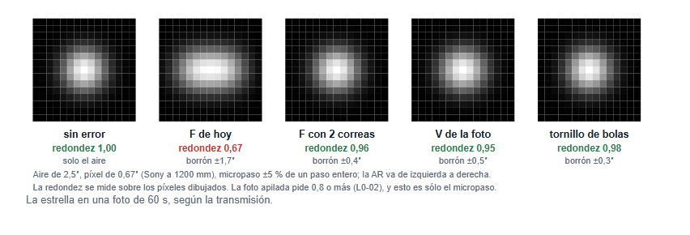
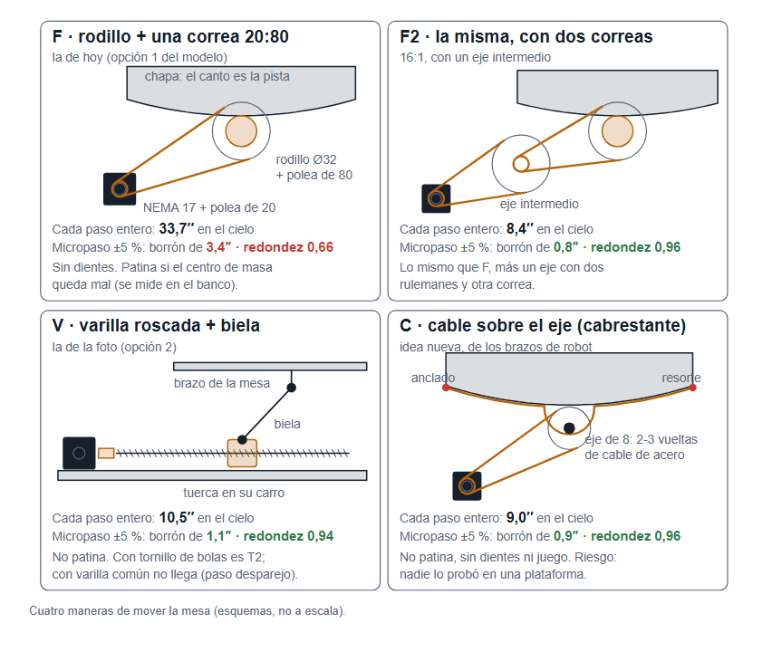
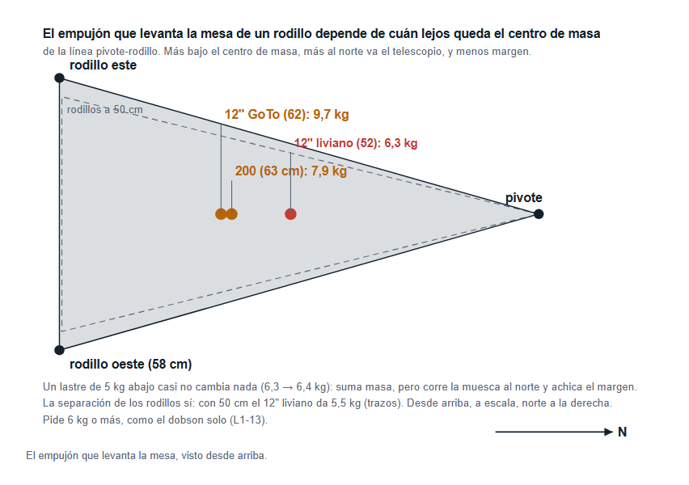

# Mecanismos, proveedores y cielo

**Escrito el 2026-10-08 a la noche (decimosexta sesión)**, a pedido de Fran:
«investigá bien los diseños y arquitecturas y avanzá el proyecto con
soluciones inteligentes; analizá en Villa Adelina qué opciones hay en los
alrededores; mecanismos, soluciones, dibujos y documentos más visuales». Es
trabajo de **Pre-Fase A** (*Concept Studies*): alternativas, factibilidad,
proveedores y cielo. **No elige** la transmisión: eso se hace en su nivel,
con Fran (PDP §4); acá van los datos para elegir. Grado de cada número entre
corchetes. Los dibujos salen de `dibujos-mecanismos.js` (la misma fuente que
el modelo 3D v10.5) y las cuentas de `transmisiones.js` y `geometria-vns.js`.

## 0. En criollo: lo que cambia

- **Un paso a paso no gira parejo, y eso estaba mal contado.** Cada paso
  entero cae con hasta ±5 % de error, y el micropaso no lo arregla. Con la F
  de hoy (rodillo y **una** correa 20:80) cada paso entero mueve ≈ 34″ el
  cielo, y ese error **estira la estrella** en cada foto: redondez 0,66, y la
  foto pide 0,8. **La F con una correa no pasa el piso de precisión.** Pasan:
  la F con **dos** correas (F2), la **V de la foto con tornillo de bolas**
  (T2) y una idea nueva, el **cable** (C). [`probable`: dato de hoja de datos
  y cálculo; el error del motor real se mide en una tarde con un puntero
  láser, §1.4]
- **Con tu orden (precisión > que no patine > facilidad > costo), la cuenta
  ahora da T2 sin empate**, con los tres métodos y se cierre o no el banco
  del rodillo (§2.3). La decisión sigue siendo tuya, en su nivel.
- **El único rojo del concepto se cerró**: con los rodillos a **58 cm** y la
  base de **1,3 m**, ningún telescopio de la envolvente vuelca antes de 22° ni
  levanta la mesa con menos de 6 kg. Un lastre **no** lo arreglaba (§3).
- **Las chapas ya no dependen del vuelco**: la corredera pone sobre el eje
  cualquier 200 con el centro de masa entre 55 y 69 cm. El vuelco ahora
  **confirma** las chapas, no las define (§4).
- **No cualquier láser corta las chapas**: son de 8 mm, y hay talleres de la
  zona que llegan a 4,7. Lista de quién sí, tornerías con rectificadora,
  rulemanes, hierros y electrónica, en §5.
- **El cielo del patio es de ciudad** (≈ 17-18 mag/″², `hipótesis`): la
  primera nebulosa sale igual (M42, Carina, la Laguna) y un filtro de dos
  bandas la ayuda mucho; el cielo oscuro más cerca es **Punta Indio**, a
  150 km y **a 0,8° de latitud** de casa, adentro de la tolerancia de la
  plataforma (§6).

## 1. El hallazgo: el error de micropaso

### 1.1 Qué es

Un motor paso a paso de 1,8° tiene 200 posiciones firmes por vuelta (los
**pasos enteros**). Entre una y otra, el driver reparte la corriente entre
las dos bobinas y crea posiciones intermedias (los **micropasos**). Dos datos
de afuera, y los dos dicen lo mismo:

- La hoja de datos de un NEMA común: *«step angle accuracy ±5 % (full step,
  no load)»*: cada paso entero cae dentro de ±5 % de donde debería.
  [`probable`: dato de catálogo; hay motores de ±3 %]
- Analog Devices (Trinamic, que fabrica el TMC2209): el micropaso **aumenta la
  resolución, no la exactitud**; la exactitud la ponen la construcción del
  motor, la carga y el driver.

El error se repite con la forma del motor: **cada 1 a 4 pasos enteros**. Con
la plataforma eso es cada 0,4 a 9 segundos. Adentro de una foto de 60 s no
corre la estrella para un lado: la **hace temblar** cientos de veces, y la
estrella sale estirada en ascensión recta.

### 1.2 Cuánto es, transmisión por transmisión

`node docs/transmisiones.js` (geometría v10.5: rodillos a 58 cm, radio del
canto 76,9 cm; palanca de la biela de la V 0,785 m), con ±5 % y un aire de
2,5″ [cálculo; controles en `node docs/probar-transmisiones.js`, con
sabotaje]:

| Transmisión | Paso entero en el cielo | Uno cada | Borrón en la foto | Redondez (sólo micropaso) | Piso |
|---|---|---|---|---|---|
| **F de hoy**: rodillo Ø32 + una correa 20:80 | 33,7″ | 2,2 s | 3,4″ | **0,66** | **no pasa** |
| F2: la misma con dos correas (16:1) | 8,4″ | 0,6 s | 0,8″ | 0,96 | pasa |
| F con motor de 0,9° (400 pasos) | 16,9″ | 1,1 s | 1,7″ | 0,87 | no pasa (borrón > 1,5″) |
| C: cable sobre el eje de 8 mm + 20:80 | 9,0″ | 0,6 s | 0,9″ | 0,96 | pasa |
| **V de la foto**: varilla de paso 8 + biela | 10,5″ | 0,7 s | 1,1″ | 0,94 | pasa |
| T2: tornillo de bolas SFU1605 (paso 5) + biela | 6,6″ | 0,4 s | 0,7″ | 0,98 | pasa |
| T2: tornillo de bolas SFU1204 (paso 4) + biela | 5,3″ | 0,4 s | 0,5″ | 0,99 | pasa |
| *Referencia*: montura EQ6 / HEQ5-R | 9,2″ / 13,5″ | | | | |

«Piso» = el borrón no supera 1,5″, que es lo que tiene **toda** la
plataforma por foto (L2-PLT-02), y la estrella queda en 0,8 o más (L0-02)
**contando sólo el micropaso**. Con ±3 % la F de hoy da 0,82 (justo, sin
margen para nada más); con ±10 %, 0,40.

**Por qué no se vio antes:** `13-revision-externa.md` §4 lo anotó («el error
de los micropasos, ≈ ±1″ cada 10 s, se confunde con el aire») y lo dio por
chico. Era ±1,7″ con ±5 %, y un temblor de ±1,7″ no se confunde con el aire:
se **suma** al aire y estira la estrella. La cuenta de los errores lentos
(poleas, rodillo, tornillo) estaba bien y sigue valiendo: esos los saca la
corrección periódica (PEC). El micropaso no, porque es demasiado rápido.

### 1.3 Lo que hacen los que saben

- La plataforma VNS de Martin Lewis (BAA, *Equatorial Platforms* parte 3):
  motor síncrono → reductor **250:1** → correa → **sinfín 40:1** → rodillo de
  30 mm. Reducen cientos de veces más que nuestra 4:1.
- Las monturas comerciales mueven 9 a 14″ por paso entero (EQ6, HEQ5-R).
- Midlands Astronomy Club: el brazo tangente (la V) «trae problemas al pasar
  el meridiano»; con biela y tabla de corrección en el programa, como la
  nuestra, ese problema es la variación de velocidad (±2,8 %), y la corrige el
  programa.

### 1.4 Cómo se mide en una tarde: la palanca óptica

Un espejito pegado al eje del motor, un puntero láser y una pared a 2 m. El
espejo duplica el ángulo: **un paso entero (1,8°) mueve el punto 126 mm**; un
micropaso de 1/16, 7,9 mm; un error de ±5 % son **±6,3 mm**, que se ven con
una regla.

1. Con el ESP32 y el TMC2209 del banco (paso 7 de «2 - Paso a paso»), mandar
   **un micropaso a la vez** y marcar en una hoja milimetrada dónde cae el
   punto: 16 marcas por paso entero, cuatro pasos enteros (64 marcas).
2. Foto de la hoja. La sesión saca el error.
3. **Si el error es ±2 % o menos**, la F de una correa alcanza y vuelve a la
   pelea; si es más, quedan F2, C y T2.

Cuesta un puntero y un espejito, y convierte un dato de catálogo en una
medida del motor que se va a usar.

### 1.5 La otra salida: por programa

El error de micropaso **se repite igual en cada ciclo del motor**. Medido con
la palanca óptica, el programa puede **dar cada micropaso en el momento
justo** (no a intervalos iguales, sino cuando el motor de verdad llegaría ahí)
y la mesa avanza pareja. Anda con el TMC2209 (es el ESP32 el que decide
cuándo); el TMC5160 permite además cargar una tabla de corriente corregida
(MSLUT). Es una salida real, pero agrega calibración y programa; con dos
correas o con tornillo el problema ni aparece. **La sesión recomienda la
salida mecánica.**

## 2. Cuatro maneras de mover la mesa

### 2.1 Lo que tiene cada una

| | Cómo empuja | A favor | En contra |
|---|---|---|---|
| **F2** | rodillo de acero por fricción, dos correas | sin dientes; si se traba, patina antes de romper | puede patinar (lo dice el banco); un eje intermedio con dos rulemanes y otra correa; dos poleas de 20 que hay que corregir con PEC |
| **T2** | tornillo de bolas, tuerca en un carro, biela con rótulas, brazo de la mesa (la V de la foto con un tornillo bueno) | **no patina**; paso fino (5-7″); los dos rodillos quedan locos (608) | la biela suma juego en las rótulas (se precarga con un resorte); el tornillo repite su error cada 1,2-1,5 min (lo saca la PEC); se importa |
| **V con varilla común** | igual que T2 con una varilla roscada de ferretería | barata, se consigue en cualquier lado | **no**: una varilla laminada común tiene el paso desparejo y alabeo de decenas de µm, que no se repiten igual cada vuelta |
| **C** (idea nueva) | un cable de acero de 0,5 mm anclado a las puntas de la chapa, que da 2-3 vueltas sobre el eje de 8 mm de una impresora (un cabrestante), con un resorte que lo tensa | **no patina** (el cable está anclado), sin dientes ni juego; usa la varilla de 8 que ya hay; lo usan los brazos de robot y los dispositivos hápticos | **nadie lo hizo en una plataforma** [`hipótesis`: no encontré ninguna]; el eje de 8 tiene que ser muy redondo (0,02 mm de descentrado dan 4″ en 60 s, más que la F); hay que probarlo |

B (correa pegada al canto) y T (varilla con brazo tangente sin corregir)
siguen afuera por lo de `14-concepto-300mm.md` §6.

### 2.2 Lo que no cambia

Con 60 s **la corrección periódica (PEC) va en cualquiera** (`14` §6b): las
poleas de 20 dan 1,7-2,8″ por foto con 0,02 mm de descentrado, el rodillo
1,1″, el tornillo 2,6-2,7″ con 5 µm de alabeo. Todo eso es lento, se repite
con la posición del motor y el programa lo saca.

### 2.3 El trade con tu orden, rehecho

Mismos criterios y misma vara que `14` §6c (1 = malo, 5 = muy bueno; los
puntajes son técnicos y los pone la sesión; **el orden es tuyo**). La F de una
correa sale **antes de votar** porque no pasa el piso; entra F2.

| Criterio | F2 | T2 | Base |
|---|---|---|---|
| 1. Margen de precisión | 4 | 4 | los dos pasan el micropaso con margen (0,8″ y 0,7″); los dos necesitan PEC para lo lento |
| 2. Que no patine | 3 (4 si el banco dice que no patina) | 5 | F2 es fricción; T2 empuja con rosca |
| 3. Facilidad de construcción | 2 | 3 | F2 = la F más un eje intermedio, dos rulemanes y otra correa; T2 = tornillo comprado con sus soportes, carro y biela |
| 4. Costo | 4 | 3 | F2: poleas, correas, rodillo torneado; T2: tornillo de bolas importado |

| Cómo se pasa tu orden a pesos | Pesos | F2 | T2 | Gana |
|---|---|---|---|---|
| ROC (Barron y Barrett) | 0,52 · 0,27 · 0,15 · 0,06 | 3,43 | **4,06** | T2 por 18 % |
| Suma de rangos | 0,40 · 0,30 · 0,20 · 0,10 | 3,30 | **4,00** | T2 por 21 % |
| Recíproco del rango | 0,48 · 0,24 · 0,16 · 0,12 | 3,44 | **3,96** | T2 por 15 % |
| ROC, si el banco dice que F no patina | | 3,70 | **4,06** | T2 por 10 % |

**Ya no empata.** El empate de antes acusaba a los criterios (lección «un
trade study que empata»): faltaba el micropaso. Con él, **T2 gana en los
cuatro casos**. Lo que la sesión propone llevar a la decisión: **T2 con un
SFU1605 o SFU1204, carro sobre guía, biela con rótulas precargadas, y PEC**.
Es, casi pieza por pieza, la plataforma de la foto que mandaron Kevin y Fran,
con un tornillo comprado en vez de una varilla. El banco del rodillo deja de
ser el que decide; el de la palanca óptica sigue sirviendo para el motor de
cualquiera.

## 3. El empujón del 12" liviano: cerrado

Era el único rojo: con los rodillos a 50 cm, un 12" liviano (40 kg, centro
de masa a 52 cm) levantaba la mesa de un rodillo con 5,5 kg de empujón en la
boca, y L1-13 pide 6 o más. Se probaron tres arreglos [cálculo,
`geometria-vns.js`]:

| Arreglo | 12" liviano | Peor vuelco | Qué cuesta | |
|---|---|---|---|---|
| Lastre de 5 kg abajo, en la mesa | 5,5 → 5,5 kg | — | nada | **no sirve**: el lastre baja el centro de masa, la muesca se corre al norte y el margen se achica lo mismo que suma la masa |
| Rodillos a 58 cm, base de 1,2 m | 6,3 kg | 21,0° | chapas de 356 mm (eran 350), mesa 9 cm más ancha | casi: el vuelco cae debajo de 22° |
| **Rodillos a 58 cm, base de 1,3 m** | **6,3 kg** (6,1 con el centro de masa a 50 cm) | **22,3°** | lo de arriba + 10 cm de base | **todo en verde**, los siete casos de la envolvente |
| Retén antilevante (un rulemán que no toca, sobre una pestaña de la chapa, como las ruedas de abajo de una montaña rusa) | cualquier cosa | — | una pieza más por chapa | idea, no hace falta: la chapa mide 30 mm en lo más angosto y no hay lugar para la pestaña sin agrandarla |

**El modelo v10.5 pasa a rodillos a 58 cm y base de 1,3 m.** Medido en el
panel con el 200 y el 12", con F y con V: «Piezas sueltas: ninguna» y
«Choques: ninguno». Al ensanchar, la punta del travesaño de la mesa pasaba a
6 mm del soporte de un fin de carrera; los fines de carrera se corrieron 1 cm
al sur (4,5 cm de la chapa) y quedó en cero.

## 4. Las chapas ya no esperan al vuelco

La forma de cada chapa sale de la altura del eje sobre la mesa (54 cm), de
la latitud y de dónde va su rodillo. **No** del centro de masa del
telescopio: ese lo absorbe la corredera, moviendo el dobson norte-sur hasta
su muesca. Medido en el modelo [cálculo]:

| Centro de masa del 200 | Muesca | ¿Las mordazas caen sobre los rieles? |
|---|---|---|
| 55 cm | 14,5 cm al norte | sí |
| 63 cm (la cuenta de hoy) | 2,8 cm al norte | sí |
| 69 cm | 5,9 cm al sur | sí |
| 70 cm | 7,4 cm al sur | **no** (se salen 1 cm) |

**Lo que cambia en el camino crítico:** el vuelco sigue siendo una medición
que cierra la fase 0 (PDP §4, dos métodos), pero ya **no cambia la forma de
las chapas** si da entre 55 y 69 cm (lo esperado: 58 a 69). Si diera más, se
alargan los rieles 2 cm hacia el sur. Las chapas siguen sin cortarse antes de
la prueba de foco (P0) y de la plantilla 1:1 (regla 3 del proyecto).

Un detalle de la envolvente: un 12" de 40 kg con el centro de masa en 50 cm
pide la muesca a 21,7 cm al norte. El riel del medio llega: el chequeo de
rieles del modelo da «sí» con ese telescopio (la cuenta a mano deja la
mordaza norte a ≈ 1,6 cm de la punta del riel).

## 5. Dónde se consigue, cerca de Villa Adelina

> Todo sale de directorios y páginas buscados el 2026-10-08. **Nada está
> visitado ni llamado**: direcciones y capacidades se confirman por teléfono
> antes de ir. `hipótesis` hasta entonces.

### 5.1 Corte láser de las chapas (acero de 5/16" = 8 mm)

| Taller | Dónde | Qué dice | ¿8 mm? |
|---|---|---|---|
| [Rapimetal](https://www.rapimetal.com/corte-laser/) | retiro en Villa Urquiza o Villa Ballester; envía a zona norte | acero al carbono **hasta 9 mm**; acepta DXF, DWG, PDF | **sí**, según su página |
| [Metalúrgica Martino](https://www.metalurgicamartino.com.ar/) | Villa Maipú (San Martín) | corte por láser y guillotina **hasta 1/2"** | **sí**, según su página |
| [Lasertec](https://lasertec.com.ar/) | Av. Mitre 1970, **Munro** | corte láser de chapas y caños, soldadura, plegado; 30 años | a preguntar |
| [Nomen Láser](https://nomen.com.ar/nomenlaser) | **Munro** | fibra de 12 kW (corta grueso) | a preguntar |
| [Oxpane](https://www.oxpane.com.ar/) | Padre Ashkar 575, San Martín | 5 equipos de corte, ISO 9001, cotiza en 24 h | a preguntar |
| [Laser 8](http://laser8.com.ar/) | Guido Spano 4435, Billinghurst | mesa de 3 × 1,5 m; inoxidable hasta 6 mm | carbono, a preguntar |
| [Metalúrgica Jorgensen](https://metalurgicajorgensen.com/) | Don Torcuato | láser, plegado, cilindrado | a preguntar |
| [Prymax](https://prymax.com.ar/corte-laser/) | Garín | carbono **hasta 4,7 mm** | **no** |

**Qué preguntar:** ¿cortan acero SAE 1010 de 5/16" (7,94 mm)? ¿precio por
metro de corte y por chapa? (son dos piezas de ≈ 370 × 135 mm, ≈ 1 m de corte
cada una) ¿qué tolerancia de contorno dan? ¿el canto sale con rebaba o con
estrías? (el canto es la pista: después se lija con un taco largo).

### 5.2 Tornería (el rodillo motriz, sólo con F2 o C)

Con F2 hace falta el **rodillo de 32 × 30 con descentrado ≤ 0,01-0,02 mm**:
eso es torno bueno o **rectificadora**.

| Tornería | Dónde | Qué anuncia |
|---|---|---|
| Tornería Acosta | Vélez Sarsfield 6049, **Munro** | torno CNC, torno paralelo, fresadora y **rectificadora** |
| Tornería Fam | Villa Adelina / Carapachay (dos direcciones en los directorios: Cané 1276 y Av. Ader 3376) | tornos CNC |
| Indufer | Santa Fe 6637, Villa Adelina | matricería, mecanizado, tornería CNC |
| Metalúrgica San Isidro | R. Wernicke 1438, Villa Adelina | tornería CNC |
| Haertel | Curupaytí 2164, Villa Adelina | tornería automática de precisión |
| Rolsim; Oscar A. Gómez | Esquiú 2436 y Cnel. Avalos 3540, Munro | tornería mecánica y CNC; «de precisión» |

Fuentes: [argentino.com.ar](https://www.argentino.com.ar/munro/mecanizado),
[laguiadeargentina](https://laguiadeargentina.com/tornerias-en-boulogne-sur-mer-buenos-aires),
[licuo](https://villa-adelina.licuo.com.ar/metalurgica-en_villa_adelina.htm).
Con T2 no hace falta tornería de precisión (el tornillo se compra hecho).

### 5.3 Rulemanes, hierros, electrónica

| Qué | Dónde | Nota |
|---|---|---|
| Rulemanes 608 (si faltan los de roller) | [Rulemanes Munro](https://www.argentino.com.ar/rulemanes-munro-sca-F1407C90E1E), Av. Mitre 2996; Distri-Rodamientos, Grierson 3772, V. López; Apiro, Mitre 601, Florida | Rulemanes Munro lista también **rodamientos lineales y ejes**: sirve para la guía del carro de la T2 |
| Tubo 20 × 20, planchuela | Hierros Misa, Tomkinson 1380, San Isidro; corralones Florida Norte (San Martín 2399) y Laprida (Laprida 4936); online: [AcerosYa](https://www.acerosya.com/productos/tubo-cuadrado-20x20x2-00/) (20 × 20 × 2 a $18.070 la barra, corta de 1 a 6 m), Hierros Torrent (20 × 20 × 1,2 a $14.851) | ya hay hierro en casa; esto es si falta. Pedir **pared de 1,6 o 2 mm** (la de 1,2 es floja para la viga) |
| NEMA 17, TMC2209, ESP32 | Mercado Libre (NEMA 17 de 1,8° entre ≈ $33.000 y $70.000) | un NEMA 17 de **0,9°** no apareció en el país |
| Tornillo de bolas SFU1605/SFU1204 + soportes BK/BF12 + acople | no encontré quién lo venda acá; afuera USD 12-35 más envío (eBay, AliExpress) | precisión C7 |
| Reductor planetario NEMA 17 | no apareció en el país; afuera EUR 22-41 (juego 15-30′) | **no** se recomienda: su error de engranaje cae adentro de la foto |

## 6. El cielo: el patio y los alrededores

| Lugar | Brillo del cielo | A cuánto | Latitud | Grado |
|---|---|---|---|---|
| Buenos Aires, cenit | 17,28 mag/″² (Amigos de la Astronomía) | — | 34,6° S | medido por otros |
| **Villa Adelina, el patio** | ≈ 17,5-18,5 (Bortle 7-8) | — | **34,5° S** | `hipótesis`: no hay medición |
| **Punta Indio** | Bortle 3, «tirando a 2» | ≈ 150 km | **35,3° S: a 0,8° de casa** | foro Espacio Profundo + municipio |
| Centro y sur de la provincia (Saladillo-Bolívar) | «comparable a cielos andinos» | 200-300 km | 35-36° S | opinión de foro, vieja |

Cada magnitud por segundo de arco al cuadrado es 2,5 veces menos cielo
encima de la nebulosa.

**Lo que cambia:**

- **La primera foto sale del patio.** Las nebulosas de emisión brillantes
  (M42, Carina, la Laguna) se fotografían desde la ciudad; lo que el cielo de
  ciudad cobra es tiempo total, no la posibilidad.
- **Un filtro de dos bandas** (deja pasar sólo el H-alfa y el O-III de las
  nebulosas) recorta mucho el cielo de ciudad: Optolong L-eNhance 1,25" (≈ USD
  170) o SVBONY SV220 de 7 nm en 1,25" (≈ USD 110). Sirve para nebulosas de
  emisión, **no** para galaxias. [`probable`: lo dicen los vendedores y los
  foros; en fotos de ciudad, el contraste de la nebulosa sube mucho]
- **¿Viaja en auto?** (pregunta abierta de `10` §11.1): Punta Indio queda a
  0,8° de latitud, **adentro del grado de tolerancia de L1-09**: la plataforma
  sirve allá sin cambiar nada, con las patas. Si viaja, L2-PLT-13 (piezas de
  hasta 125 cm) se mide contra el baúl: con la base de 1,3 m la viga sur mide
  1,22 m, pero los dos lados soldados al pie norte forman una V de 1,25 m de
  lado y 1,22 m de abertura, que es una pieza grande y chata. Si el baúl no la
  lleva, un lado se abulona en vez de soldarse [cálculo, `geometria-vns.js`].

## 7. La cámara en el portaocular de 1,25"

La Sony ZV-E10 tiene un sensor APS-C de 28,2 mm de diagonal. Un portaocular
de 1,25" tiene ≈ 27-28 mm de paso libre, y un filtro de 1,25" ≈ 26 mm.
**Las esquinas de la foto van a salir oscuras (viñeteo).** [`hipótesis`:
depende del adaptador; se ve en la prueba de foco P0]. No impide la foto: se
corrige con *flats* y recortando. Si molesta, la salida es un portaocular de
2" (sale de la prueba de foco, no de la plataforma).

## 8. Lo que es tuyo

1. **La transmisión** (cuando se decida en su nivel): con tu orden, la cuenta
   da **T2** (§2.3). ¿Hay algo que pese y no esté en los cuatro criterios?
   (por ejemplo: que se pueda hacer todo con piezas del país).
2. **El banco de la palanca óptica** (§1.4), con Kevin: una tarde, el motor
   del banco, un puntero y un espejito. Da el número que hoy es de catálogo.
3. **¿Un filtro de dos bandas?** Si la primera foto es del patio, es lo que
   más la mejora por plata (§6).
4. **¿Viaja?** Punta Indio entra en la tolerancia de latitud tal como está.

## 9. Fuentes

- [Analog Devices, *Mastering Precision: Understanding Microstepping*](https://www.analog.com/en/resources/analog-dialogue/articles/mastering-precision-understanding-microstepping.html);
  [Hackaday, *How accurate is microstepping really?*](https://hackaday.com/2016/08/29/how-accurate-is-microstepping-really/);
  [Machine Design, *Microstepping myths and realities*](https://www.machinedesign.com/motors-drives/whitepaper/21831873/stepper-motors-microstepping-myths-and-realities);
  hoja de datos de un NEMA 14 de 1,8° con ±5 % ([probots](https://probots.co.in/pb35hs34-1004-nema14-2-phase-hybrid-stepper-motor-with-300mm-cable-round-shaft-1-8-degree.html)).
- [BAA, Martin Lewis, *Equatorial Platforms* parte 3](https://britastro.org/section_information_/telescope-making/equatorial-platforms-part-three);
  [Midlands Astronomy Club, *Equatorial Platform Info*](https://www.midlandsastronomyclub.org/projects/eq_platform_info.shtml).
- EQ6 (9.024.000 micropasos por vuelta): [IceInSpace](https://www.iceinspace.com.au/forum/showthread.php?p=1048888);
  HEQ5-R Pro (6.144.000): [Sky-Watcher](https://www.skywatcher.com/product/heq5-r-pro/).
- TMC5160 y su tabla de micropaso: [Klipper](https://klipper.discourse.group/t/access-to-tmc-microstep-lookup-table-registers/2903).
- Talleres: los enlaces de §5.
- Cielo: [Espacio Profundo](https://www.espacioprofundo.com/topic/32205-busco-cielos-oscuros-bortle-1-o-2/),
  [Punta Indio, municipio](https://puntaindio.gov.ar/frontend/images/PDF%20TURISMO%20NUEVO.pdf),
  [coordenadas](https://satellites.pro/mapa_de_Punta_Indio).
- Filtros: [Starizona, L-eNhance 1,25"](https://starizona.com/products/optolong-l-enhance-1-25),
  [SVBONY SV220 7 nm](https://telescopescanada.ca/products/svbony-sv220-dual-band-7nm-nebula-filter-w9172b).
